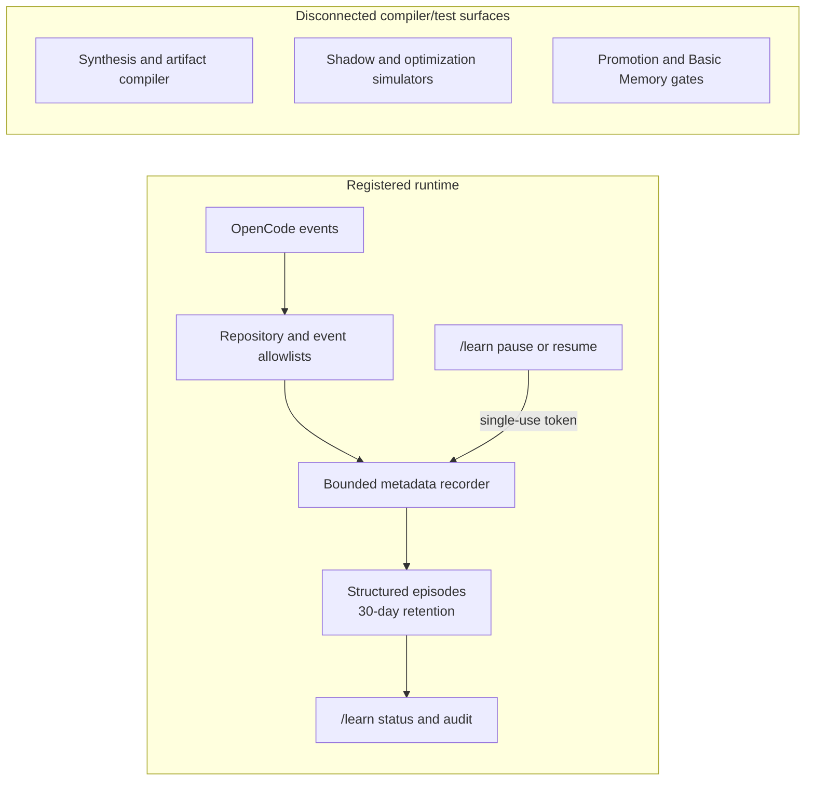

# Open Rig

<p align="center"></p>

<p align="center"><strong>The autonomous agent harness for OpenCode.</strong><br>
Give your AI agent eyes, hands, memory, tools, and the ability to operate your computer.</p>

Open Rig is a modular Ubuntu computer-use harness for OpenCode. It combines
skills, bounded MCP/runtime wrappers, v2 server and CLI plugins, setup scripts,
and maintainer gates. Capability claims below describe repository code and
checked configuration; provider availability and live UI behavior still depend
on the target installation and fresh verification.

## Current evidence boundary

- **Orchestration:** `opencode.json` configures both `explore` and `general` to
  `openai/gpt-5.6-luna#max`. Orchestration permits background children only and
  enforces a hard maximum of three after host/cgroup memory approval.
- **Visible commands:** the latest rendered check found blank bodies for
  `/session-context`, `/tools`, and `/learn`; that is pre-fix historical
  evidence. The reviewed source now routes these commands through supported CLI
  dialogs backed by bounded RPCs, without model generation, session resume, or
  synthetic inbox messages. This source change is not live acceptance: after a
  shared-service restart, fresh rendered and interaction checks are still
  required. The direct `session_context` backend is a separate surface and
  needs independent evidence.
- **Plugin `/subagents`:** the reviewed CLI plugin adds a separate, read-only
  fullscreen session panel showing at most 32 same-project/directory child
  sessions with bounded resolved `provider/model#variant` values. It does not
  modify or equal the native bottom Subagents panel: v2.0.7 exposes no
  supported row-renderer or data hook. The native panel still omits model and
  variant, and no installed OpenCode binary patch is permitted.
- **Model omission:** the source hook and package test resolve an omitted or
  `<unresolved>` model through the configured agent model, but this is not
  accepted as live behavior. After a TUI restart, the shared service still rejected an
  omitted-model continuation as `model <unresolved>`; only an explicit,
  previously approved `openai/gpt-5.6-luna#max` pin succeeded. A TUI restart
  alone does not reload server plugin code.
- **In progress:** the portable evidence gate and command/model fixes still
  require fresh rendered and interaction evidence; source and tests alone do
  not make live acceptance complete.

## Feature tour

- **Desktop, browser, repository, and memory workflows:** 19 skills cover
  GNOME inspection and control, visible or explicitly headless Playwright,
  browser-game QA, GitHub operations, Blender and web 3D assets, durable task
  memory, bounded same-project session context, application setup,
  troubleshooting, files, automation, database maintenance, development
  conventions, skill maintenance, agent orchestration, and VS Code.
- **v2 Explorer:** the `file-manager` CLI plugin provides a docked tree,
  quick-open, tabs, viewer, and explicit-save editor. Its parser matrix has 21
  manifest-managed Tree-sitter languages (JSON/JSONC, YAML, TOML, Bash, Python,
  Go, Rust, SQL, HTML, CSS/SCSS, XML, C, C++, Java, Ruby, PHP, Lua, Dockerfile,
  INI, diff, and Makefile) with SHA-256 checked assets. JavaScript/JSX,
  TypeScript/TSX, Markdown, and Zig come from the installed OpenTUI version;
  plain text remains the fallback. Missing native rendering or workers are
  reported or skipped by the package checks rather than hidden.
- **Per-TUI resource footer:** `resource-monitor` reports CPU and RSS for the
  current TUI process tree, excluding the shared `opencode serve --service`
  subtree. It reads local `/proc` metadata only and does not transmit samples.
- **Agent orchestration:** the `agent-orchestration` skill uses `explore` for
  planning/reconnaissance, normally `general` for implementation, and preserves
  `Build` access to all configured subagents. Every child runs in the background
  to preserve tokens; each batch is capped at three children and must first pass
  an `agent_memory_capacity` check. The main agent retains ownership,
  verification, and separate commit and push approvals.
- **Maintainer gates:** `rig-tools` exposes `repo_qa_gate`,
  `repo_documentation_gate`, `repo_commit`, and `repo_push`. They bind evidence
  to repository state, require the configured checks, keep staged scope exact,
  and require distinct approval for commit and push. Raw shell commit/push is
  denied by the plugin policy.
- **Open Rig branding:** product-facing copy uses Open Rig for the harness and
  OpenCode for the underlying runtime. The visual system and approved SVG
  assets are documented in [`docs/brand.md`](docs/brand.md).

## Repository Learning Engine (RLE)

RLE is deployed only for opt-in, summaries-only observation and a read-only
review scaffold. It observes bounded metadata automatically unless explicitly paused, and it is not a replacement for the existing
Basic Memory/task-memory workflow. Synthesis, promotion, active retrieval, and
optimization are disconnected compiler/test surfaces with no live runtime edge:



The active runtime never stores prompts, tool inputs, tool outputs, transcripts,
or error text. It does not synthesize candidates, write Basic Memory, retrieve
learning into a task, modify files, install dependencies, commit, push, or
weaken permissions.

The `/learn` backend and its package tests do not prove visible command
rendering; its latest rendered body was blank pre-fix and remains
broken/unverified until a fresh rendered and interaction check passes.

## Supported boundary

The checked target is Ubuntu 26.04.1 LTS amd64 with GNOME on Wayland,
OpenCode v2.0.7 (or a compatible v2 release validated by the checks), Node.js
22.6+ for plugin checks, Python 3, `python3-pyatspi`, `ydotool`, and
`wl-clipboard`. Other Linux distributions are not claimed as supported. Some
workflows additionally use the optional Blender and NumPy installation.

## Setup and verification

Start read-only, review the output, then apply explicitly:

```bash
./platforms/linux/ubuntu/computer-use/scripts/setup-computer-assistant.sh --verify-only
./platforms/linux/ubuntu/computer-use/scripts/setup-computer-assistant.sh --apply
./platforms/linux/ubuntu/computer-use/scripts/deploy-plugins.sh --plugins all --apply
./platforms/linux/ubuntu/computer-use/scripts/verify-opencode-v2.sh
```

`setup-opencode.sh` deploys the 19 skills, repository commands, v2 config, and
managed parser assets. `deploy-plugins.sh` registers the ten packages from
`config/v2-plugin-roles.json`; `verify-opencode-v2.sh` checks the resulting
installation. Setup and deployment preserve existing config and are read-only
unless `--apply` is supplied. Restart the shared OpenCode service—not only the
TUI—after changing skills, MCP declarations, configuration, or plugins; a TUI
restart alone does not reload server plugin code.

## Safety and limits

Desktop mutations use preview/apply tokens. Explorer operations enforce project
containment, reject `.git`, unsafe symlinks, unsuitable content, stale edits,
and unsafe saves. Browser profiles are isolated. Secrets remain in managed auth
stores or environment references, not this repository or memory. Publishing,
deleting, purchasing, security changes, permission changes, commit, and push
remain confirmation-gated; passwords, MFA, payment data, and CAPTCHAs are not
handled in chat. Explorer's broader IDE roadmap and native rendered UI
acceptance are not claimed complete merely because the package exists.

## Documentation

- [Maintainer feature inventory](docs/maintainer-features.md) - paths, surfaces,
  evidence, boundaries, and known limits.
- [Documentation index](docs/README.md)
- [Ubuntu computer-use guide](platforms/linux/ubuntu/computer-use/README.md)
- [v2 plugin workspace](platforms/linux/ubuntu/computer-use/plugins-v2/README.md)
- [19-skill catalog](platforms/linux/ubuntu/computer-use/skills/README.md)

Open Rig is intentionally modular: remove an individual plugin registration and
restart OpenCode without removing the other skills, MCPs, or plugins. No root
license is declared in this repository.
