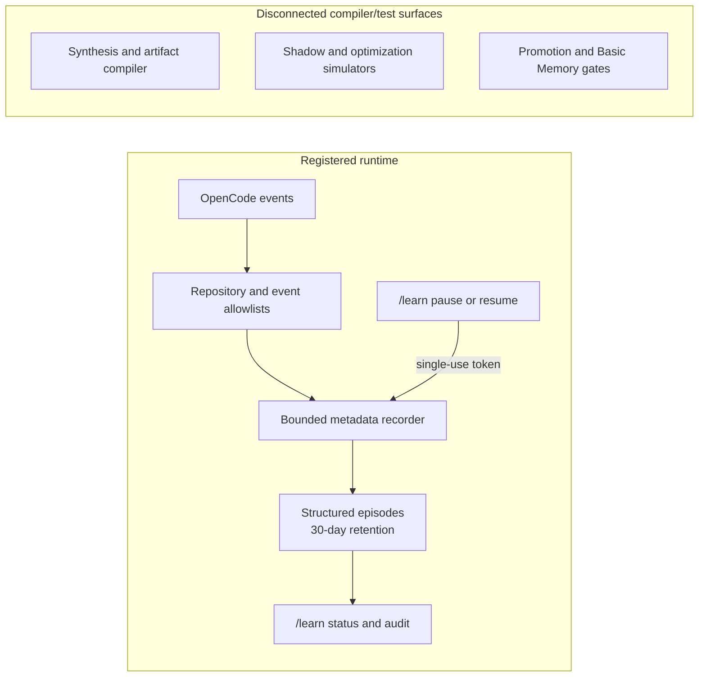

# Open Rig

<p align="center"></p>

<p align="center"><strong>The autonomous agent harness for OpenCode.</strong><br>
Give your AI agent eyes, hands, memory, tools, and the ability to operate your computer.</p>

Open Rig is a modular computer-use harness for OpenCode with native Ubuntu and
Ubuntu-on-WSL2 profiles. Generic MCP/runtime ownership is canonical under
`platforms/linux/ubuntu/computer-use`; WSL retains only its Windows/WSL
interop package and isolated profile state. The project combines skills,
bounded MCP/runtime wrappers, v2 server and CLI plugins, setup scripts, and
maintainer gates. Capability claims below describe repository code and checked
configuration; provider availability and live UI behavior still depend on the
target installation and fresh verification.

## Current evidence boundary

- **Orchestration:** `opencode.json` configures implementation/exploration roles
  `build`, `explore`, and `general` with `openai/gpt-6-luna#max`, and planning
  role `plan` and read-only architecture/design subagent `architect` with
  `openai/gpt-6-sol#max`. These are source assignments; existing sessions retain
  their selected model until changed. Orchestration permits background children
  only and reads the operator-controlled `maxConcurrent` value from project
  config. Its supported range is `1..10`; `agent_memory_capacity` is an
  optional, read-only host/cgroup diagnostic and never blocks or reduces
  configured admission.
- **Visible commands:** the latest rendered check found blank bodies for
  `/session-context`, `/tools`, and `/learn`; that is pre-fix historical
  evidence. The reviewed source now routes these commands through supported CLI
  dialogs backed by bounded RPCs, without model generation, session resume, or
  synthetic inbox messages. This source change is not live acceptance: after a
  shared-service restart, fresh rendered and interaction checks are still
  required. The direct `session_context` backend is a separate surface and
  needs independent evidence.
- **Plugin `/subagents`:** the reviewed CLI plugin adds a separate, read-only
  fullscreen session panel showing at most 32 same-project/directory child
  sessions with bounded resolved `provider/model#variant` values. It does not
  modify or equal the native bottom Subagents panel: v2.0.7 exposes no
  supported row-renderer or data hook. The native panel still omits model and
  variant, and no installed OpenCode binary patch is permitted.
- **Model omission:** the source hook and package test resolve an omitted or
  `<unresolved>` model through the configured agent model, but this is not
  accepted as live behavior. After a TUI restart, the shared service still rejected an
  omitted-model continuation as `model <unresolved>`; only an explicit,
  previously approved `openai/gpt-5.6-luna#max` pin succeeded in that historical
  pre-migration run. A TUI restart alone does not reload server plugin code.
- **In progress:** the portable evidence gate and command/model fixes still
  require fresh rendered and interaction evidence; source and tests alone do
  not make live acceptance complete.

## Feature tour

- **Desktop, browser, repository, and memory workflows:** 19 skills cover
  GNOME inspection and control, visible or explicitly headless Playwright,
  browser-game QA, GitHub operations, Blender and web 3D assets, durable task
  memory, bounded same-project session context, application setup,
  troubleshooting, files, automation, database maintenance, development
  conventions, skill maintenance, agent orchestration, and VS Code.
- **v2 Explorer:** the `file-manager` CLI plugin provides a docked tree,
  quick-open, tabs, viewer, and explicit-save editor. Its parser matrix has 21
  manifest-managed Tree-sitter languages (JSON/JSONC, YAML, TOML, Bash, Python,
  Go, Rust, SQL, HTML, CSS/SCSS, XML, C, C++, Java, Ruby, PHP, Lua, Dockerfile,
  INI, diff, and Makefile) with SHA-256 checked assets. JavaScript/JSX,
  TypeScript/TSX, Markdown, and Zig come from the installed OpenTUI version;
  plain text remains the fallback. Missing native rendering or workers are
  reported or skipped by the package checks rather than hidden.
- **Per-TUI resource footer:** `resource-monitor` reports CPU and RSS for the
  current TUI process tree, excluding the shared `opencode serve --service`
  subtree. It reads local `/proc` metadata only and does not transmit samples.
- **Agent orchestration:** the `agent-orchestration` skill uses `explore` for
  reconnaissance under Sol-led planning, normally `general` for implementation,
  `architect` for delegated architecture/design, and preserves
  `Build` access to all configured subagents. Every child runs in the background
  to preserve tokens; project `maxConcurrent` (`1..10`) is the sole child-
  concurrency admission gate. `agent_memory_capacity` is an optional, read-only
  host/cgroup diagnostic; low, invalid, or unavailable results do not block,
  delay, or reduce admission. The main agent retains ownership, verification,
  and separate commit and push approvals.
- **Maintainer gates:** `rig-tools` exposes `repo_qa_gate`,
  `repo_documentation_gate`, `repo_commit`, and `repo_push`. They bind evidence
  to repository state, require the configured checks, keep staged scope exact,
  and require distinct approval for commit and push. Raw shell commit/push is
  denied by the plugin policy.
- **Agent-free recovery:** `opencode-recovery.py` diagnoses an explicitly
  selected OpenCode V2 service and provides bounded Basic Memory readiness
  recovery. The `rig-tools` tool is preview-first for native marker repair;
  connected status is not `read_note` proof. See the
  [recovery guide](docs/scripts/opencode-recovery.md).
- **Open Rig branding:** product-facing copy uses Open Rig for the harness and
  OpenCode for the underlying runtime. The visual system and approved SVG
  assets are documented in [`docs/brand.md`](docs/brand.md).

## Repository Learning Engine (RLE)

RLE is deployed only for opt-in, summaries-only observation and a read-only
review scaffold. It observes bounded metadata automatically unless explicitly paused, and it is not a replacement for the existing
Basic Memory/task-memory workflow. Synthesis, promotion, active retrieval, and
optimization are disconnected compiler/test surfaces with no live runtime edge:


```mermaid
flowchart LR
  subgraph ACTIVE["Registered runtime"]
    E["OpenCode events"] --> F["Repository and event allowlists"]
    F --> R["Bounded metadata recorder"]
    R --> L["Structured episodes<br/>30-day retention"]
    L --> C["/learn status and audit"]
    O["/learn pause or resume"] -->|single-use token| R
  end

  subgraph OFF["Disconnected compiler/test surfaces"]
    S["Synthesis and artifact compiler"]
    H["Shadow and optimization simulators"]
    P["Promotion and Basic Memory gates"]
  end
```

The active runtime never stores prompts, tool inputs, tool outputs, transcripts,
or error text. It does not synthesize candidates, write Basic Memory, retrieve
learning into a task, modify files, install dependencies, commit, push, or
weaken permissions.

The `/learn` backend and its package tests do not prove visible command
rendering; its latest rendered body was blank pre-fix and remains
broken/unverified until a fresh rendered and interaction check passes.

## Supported boundaries

The checked native target is Ubuntu 26.04.1 LTS amd64 with GNOME on Wayland,
OpenCode v2.0.11 (or a compatible v2 release validated by the checks), Node.js
22.6+ for profile-owned integrations, Python 3, `python3-pyatspi`, `ydotool`,
and `wl-clipboard`. Repository QA uses the separate checksum-pinned Node
`26.4.0` runtime under ignored `toolchains/node/`; it does not replace the
profile-owned Node `22.22.2` MCP runtime. Other Linux distributions are not
claimed as supported. Some workflows additionally use the optional Blender
and NumPy installation.

The independent Windows target is Ubuntu under WSL2 with systemd, Windows
interoperability, OpenCode v2.0.7 through the rendered compatibility ceiling,
and PowerShell 7 or Windows PowerShell. Its source provides isolated config,
built-in web search, bounded PowerShell JSON-RPC, Windows UI Automation, and an
additive native-preserving sidebar. Source checks do not substitute for live
WSL2, Windows UI, provider-authentication, or rendered-TUI acceptance.

## Bootstrap

`./bootstrap.sh` is the single cross-platform entry point. It defaults to a
strictly read-only verification; no files, logs, configuration, or system state
are written unless `--apply` is selected explicitly. Both platforms receive the
complete user-space Open Rig stack. Native Ubuntu additionally provisions the
GNOME/AT-SPI and input integration, while WSL2 keeps Windows interop and its
profile state isolated.

Both platform paths verify the repository-local Node `26.4.0` QA runtime.
Bootstrap `--apply` installs it from the pinned official archive when absent;
the runtime remains in the checkout and outside WSL pilot/profile state.

### Native Ubuntu quick start

Prerequisites are a supported Ubuntu checkout with Bash, Python 3, Node.js/npm,
Git, `awk`, `sha256sum`, and an OpenCode v2-compatible binary. Native `--apply`
may need interactive `sudo` for GNOME/AT-SPI, `ydotool`, `wl-clipboard`, and the
input group; use `--user-only` to skip those privileged steps.

```bash
./bootstrap.sh --platform native --verify-only
./bootstrap.sh --platform native --apply
```

### Ubuntu under WSL2 quick start

Prerequisites are WSL2 with systemd and Linux/Windows interoperability, Python
3, Node.js/npm, Git, `awk`, `sha256sum`, and PowerShell 7 (`pwsh.exe`) or
Windows PowerShell (`powershell.exe`). WSL2 also requires the Windows UI
Automation prerequisites for host-side UI checks; its screenshot fallback
keeps PNG bytes in memory.

```bash
./bootstrap.sh --platform wsl2 --verify-only
./bootstrap.sh --platform wsl2 --apply
```

With `--platform auto` (the default), the script selects WSL2 when
`/proc/sys/kernel/osrelease` contains both `microsoft` and `WSL` (case
insensitive), and otherwise selects native Ubuntu. The WSL2 path invokes its
isolated platform entry points and never the native top-level script or native
profile state.

The complete CLI is:

```text
./bootstrap.sh --verify-only              # default; strictly read-only
./bootstrap.sh --apply                    # additive, journaled apply
./bootstrap.sh --platform auto|native|wsl2
./bootstrap.sh --user-only                # skip sudo/privileged native steps
./bootstrap.sh --dry-run                  # print the ordered stage plan only
./bootstrap.sh --help
```

Apply state is journaled under
`${XDG_STATE_HOME:-$HOME/.local/state}/open-rig/bootstrap/`. The repository
`opencode.json` SHA-256 is recorded before and after the run and must be
byte-identical; a mismatch is a failure rather than an invitation to overwrite
the project configuration. Native apply delegates the user-space desktop
integration. WSL2 provisions its isolated config/data/cache/state paths and
checks PowerShell interop, Windows UI Automation registration, and the
in-memory screenshot fallback; it does not mutate the Windows host.

### Security and authentication

Bootstrap uses only the existing authenticated `gh` session for GitHub. It
never prints, persists, or passes a GitHub token in argv; an absent `gh` binary
or login is a `NOTICE`, not a bootstrap failure. Provider credentials remain in
OpenCode's v2 connection store or approved environment/ambient connections;
bootstrap does not copy or expose them. Token-bearing `GH_TOKEN` and
`GITHUB_*` environment variables are removed before delegates run. Complete
provider authentication or relogin through OpenCode's normal auth flow after
applying if a provider or connection is not yet active. A native input-group
change may require a full logout/login before verification succeeds.

### Exit codes and rollback

Exit codes are stable: `0` means success or fully verified, `1` means a
verification check failed, `2` means a usage error, `3` means a required
prerequisite is missing, and `4` means an apply stage failed. For code `4`, the
journal path and failing stage are printed so recovery does not depend on
guessing which step ran.

Apply is additive and does not remove unrelated files or configuration; it has
no automatic uninstall or rollback phase. To roll back, stop any private
service, review the journal's stage/status and hash record, and reverse only
the additions owned by the selected delegate, leaving pre-existing files
untouched. For WSL2, quarantine the pilot directory rather than merging it into
native state. Native rollback consists of stopping the private ydotool service
and, after reviewing local policy, reversing the GNOME/input changes and other
user-space additions deliberately. The detailed staged rollback procedure is in
[`docs/scripts/bootstrap.md`](docs/scripts/bootstrap.md).

### Limitations

Privileged native stages require interactive `sudo`, and fresh full WSL2
`--apply` acceptance is still pending. Live provider authentication, WSLg,
Windows-side action approval, and rendered TUI behavior remain target-dependent;
source or package checks do not replace those acceptance steps.

## Setup and verification

For normal cross-platform setup, use the Bootstrap section above. The following
lower-level commands remain available for maintainers who need to verify or
operate one canonical component explicitly; each write still requires its own
`--apply`.

```bash
./platforms/linux/ubuntu/computer-use/scripts/setup-computer-assistant.sh --verify-only
./platforms/linux/ubuntu/computer-use/scripts/setup-computer-assistant.sh --apply
./platforms/linux/ubuntu/computer-use/scripts/deploy-plugins.sh --plugins all --apply
./platforms/linux/ubuntu/computer-use/scripts/verify-opencode-v2.sh
```

`setup-opencode.sh` deploys the 19 skills, opt-in ChatGPT agent, repository
commands, v2 config, and managed parser assets. `deploy-plugins.sh` registers
the thirteen packages from `config/v2-plugin-roles.json`, including the pinned
official Ponytail package behind its local v2 adapter; `verify-opencode-v2.sh` checks the resulting
installation. Setup and deployment preserve existing config and are read-only
unless `--apply` is supplied. Restart the shared OpenCode service—not only the
TUI—after changing skills, MCP declarations, configuration, or plugins; a TUI
restart alone does not reload server plugin code.

For Ubuntu under WSL2, use the independent profile and source verifier:

```bash
./platforms/windows/wsl2/ubuntu/computer-use/scripts/setup-opencode.sh --apply
./platforms/windows/wsl2/ubuntu/computer-use/scripts/setup-mcps.sh --apply
./platforms/windows/wsl2/ubuntu/computer-use/scripts/verify-wsl2.sh --source
./platforms/windows/wsl2/ubuntu/computer-use/scripts/opencode-wsl2.sh
```

The WSL2 scripts never merge the repository's native-Ubuntu project config or
native profile state. They delegate generic MCP source, declarations, and
runtime verification to the canonical Ubuntu tree. Run `verify-wsl2.sh --live`
inside the target distribution before claiming systemd, interoperability,
PowerShell, Windows UI, web-search-provider, or rendered-sidebar acceptance.
Basic Memory, GitHub, and ChatGPT use canonical launchers. GitHub obtains its
transient child credential from the existing authenticated `gh` session;
ChatGPT reuses OpenCode's active OpenAI OAuth connection and has no API-key
fallback. No token belongs in configuration.

## Safety and limits

Desktop mutations use preview/apply tokens. Explorer operations enforce project
containment, reject `.git`, unsafe symlinks, unsuitable content, stale edits,
and unsafe saves. Browser profiles are isolated. Secrets remain in managed auth
stores or environment references, not this repository or memory. Publishing,
deleting, purchasing, security changes, permission changes, commit, and push
remain confirmation-gated; passwords, MFA, payment data, and CAPTCHAs are not
handled in chat. Explorer's broader IDE roadmap and native rendered UI
acceptance are not claimed complete merely because the package exists.

## Documentation

- [Maintainer feature inventory](docs/maintainer-features.md) - paths, surfaces,
  evidence, boundaries, and known limits.
- [Documentation index](docs/README.md)
- [Ubuntu computer-use guide](platforms/linux/ubuntu/computer-use/README.md)
- [Ubuntu-on-WSL2 computer-use guide](platforms/windows/wsl2/ubuntu/computer-use/README.md)
- [v2 plugin workspace](platforms/linux/ubuntu/computer-use/plugins-v2/README.md)
- [19-skill catalog](platforms/linux/ubuntu/computer-use/skills/README.md)

Open Rig is intentionally modular: remove an individual plugin registration and
restart OpenCode without removing the other skills, MCPs, or plugins. No root
license is declared in this repository.

## ChatGPT MCP

The portable project and native/isolated-WSL global profiles declare exactly
`basic-memory`, `github`, and `chatgpt`. The former project-only Playwright MCP
and Chrome-for-Testing provisioning are removed. WSL browser actions use the
Windows-default-browser connector with Playwright-like tools in place of that
MCP.

ChatGPT image generation, web search and source returns, session-private chat,
and WSL browser actions remain unverified live until bounded capability probes
and rendered/interaction checks pass. The opt-in `chatgpt-private` agent uses a
neutral workspace outside the repository and does not change Open Rig's default
agent.
